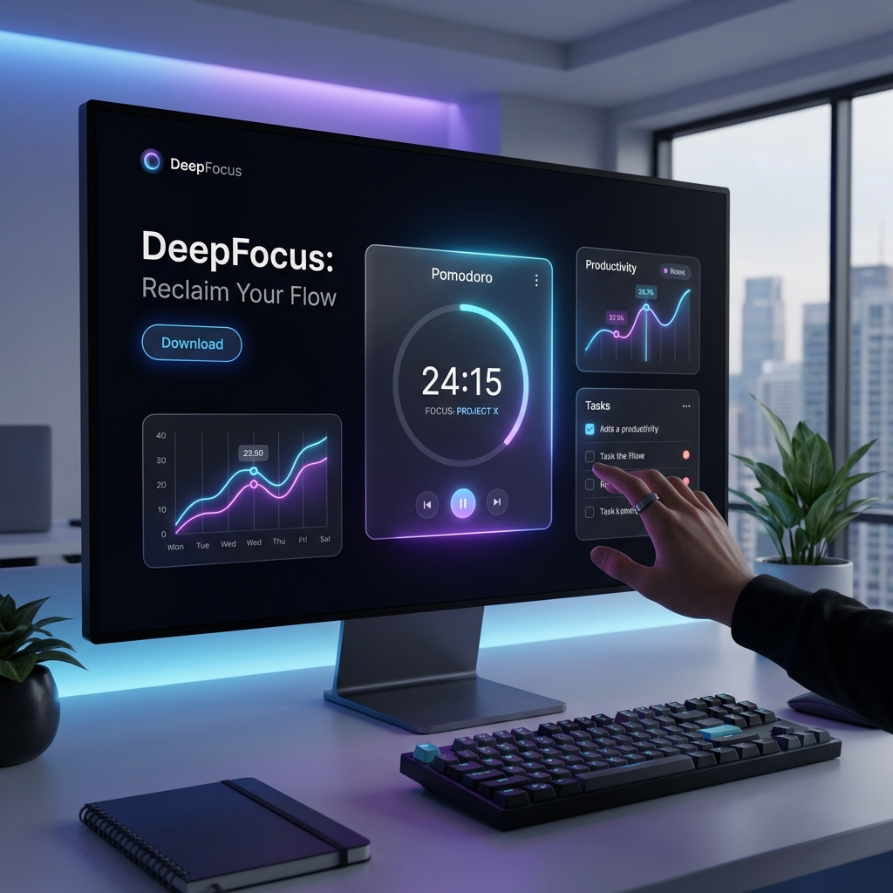

# 🎯 DeepFocus: Reclaim Your Flow



**🌐 Live Demo:** [https://deepfocus-v2-kashif.vercel.app](https://deepfocus-v2-kashif.vercel.app)  
**🔗 Backend API:** [https://deepfocus-backend.onrender.com](https://deepfocus-backend.onrender.com)

DeepFocus is a high-fidelity, full-stack productivity ecosystem designed to help you track activities, analyze your performance, and master your time. Built with a modern glassmorphic aesthetic and a robust MERN stack, it provides everything you need to stay in the zone.

---

## ✨ Key Features

- **🚀 DeepWork Pomodoro Timer**: Integrated focus sessions with 25/5 intervals and audio alerts.
- **📊 Advanced Analytics**: Visual insights through dynamic charts (Pie/Bar) with theme-adaptive styling.
- **🎯 Weekly Missions**: Set and track personalized goals with real-time progress bars.
- **🌗 Dynamic Theme Engine**: Seamless switching between premium Light and Dark modes.
- **📧 Automated Weekly Reports**: Get personalized productivity summaries delivered to your inbox every Sunday.
- **🔍 Smart Filtering**: Search and filter activities by category or title for quick retrieval.
- **📄 Pro Export**: Generate and download professional PDF and CSV reports of your activity history.
- **🔐 Secure Auth**: Built-in user authentication using JWT and bcrypt.

---

## 🛠️ Tech Stack

### Frontend
- **Framework**: React 19 (Vite)
- **Styling**: Vanilla CSS (Custom Design System, Glassmorphism)
- **Visualization**: Recharts
- **Icons**: Lucide React
- **PDF Generation**: jsPDF & jsPDF-AutoTable

### Backend
- **Runtime**: Node.js & Express
- **Database**: MongoDB (Mongoose)
- **Scheduling**: Node-Cron
- **Email Service**: Nodemailer
- **Security**: JWT & BcryptJS

---

## 🚀 Getting Started

### Prerequisites
- Node.js (v18+)
- MongoDB Atlas account or local MongoDB instance

### 1. Clone & Install Dependencies
```bash
# Clone the repository
git clone https://github.com/Kashif7180/DeepFocus.git
cd DeepFocus

# Install Backend dependencies (Root)
npm install

# Install Frontend dependencies
cd frontend
npm install
```

### 2. Environment Variables
Create a `.env` file in the `backend/` directory:
```env
PORT=5000
MONGO_URI=your_mongodb_connection_string
JWT_SECRET=your_super_secret_key

# Email Configuration (for Weekly Reports)
EMAIL_HOST=smtp.gmail.com
EMAIL_PORT=587
EMAIL_USER=your-email@gmail.com
EMAIL_PASS=your-google-app-password
```

### 3. Run the Application
You can now run both the frontend and backend with a single command from the root directory:
```bash
npm run dev
```

Alternatively, you can run them separately:
**Backend:**
```bash
npm run server
```

**Frontend:**
```bash
npm run client
```

---

## 🌐 Deployment

This project is deployed using a **split architecture** for optimal performance:

### **Frontend (Vercel)**
- **URL**: [https://deepfocus-v2-kashif.vercel.app](https://deepfocus-v2-kashif.vercel.app)
- **Platform**: Vercel (Automatic deployments from `main` branch)
- **Build**: Vite production build with optimized assets

### **Backend (Render)**
- **URL**: [https://deepfocus-backend.onrender.com](https://deepfocus-backend.onrender.com)
- **Platform**: Render.com (Free tier)
- **Note**: First request may take 30-40 seconds (cold start) on free tier

### **Database**
- **MongoDB Atlas** (Cloud-hosted, always available)

---

## 📧 Automated Report Service
The backend includes a scheduled service (`node-cron`) that generates and sends a weekly productivity report to all users.
- **Schedule**: Every Sunday at 9:00 PM.
- **Contents**: Total focus time, planning efficiency, and category-wise breakdown.
- **Test Mode**: Trigger reports manually via `POST /api/admin/trigger-reports`.

---

## 🎨 Design Philosophy
DeepFocus uses a **Glassmorphic Design System** that prioritizes focus and visual hierarchy.
- **Vibrant Badges**: Color-coded activity categories for quick identification.
- **Micro-interactions**: Subtle hover states and smooth transitions.
- **Zero Placeholders**: Using high-quality AI-generated assets and professional typography.

---

## 📄 License
This project is licensed under the MIT License - see the LICENSE file for details.

---

**Developed by:** [Syed Mohd Kashif Rizvi](https://github.com/Kashif7180)  
*Made with ❤️ for high-performers.*
